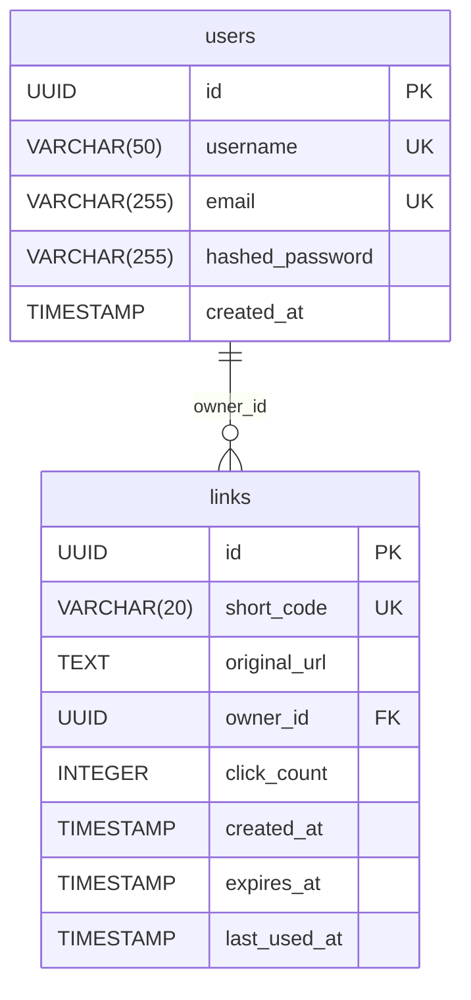

# Проект № 3 по дисциплине: "Прикладной Python"
## Создание веб-сервиса для сокращения ссылок (URL Shortener)

### Описание
REST API веб-сервис для сокращения ссылок. Позволяет пользователям превращать длинные URL-адреса в короткие, собирать статистику переходов и управлять своими ссылками.

**Основные возможности:**
- Генерация коротких ссылок (случайный ID или пользовательский `alias`).
- Редирект с короткой ссылки на оригинальную с подсчетом кликов.
- Указание времени жизни ссылки (после истечения она недоступна).
- Сбор статистики: количество переходов, дата последнего использования.
- Регистрация и авторизация пользователей (JWT токены).
- Фоновая очистка истекших и давно не используемых ссылок.
- **Кэширование** частых запросов с использованием Redis для быстрого редиректа.

---

### Технологический стек
- **Backend:** FastAPI, Python 3.12, Uvicorn
- **ORM & DB:** SQLAlchemy (Async), PostgreSQL, Alembic (миграции)
- **Кэширование:** Redis
- **Авторизация:** JWT (PyJWT), хеширование паролей bcrypt
- **Инфраструктура:** Docker, Docker Compose, `uv` (пакетный менеджер)

---

### Инструкция по запуску

#### Запуск через Docker
Убедитесь, что у вас установлен `Docker` и `Docker Compose`.

1. Клонируйте репозиторий и перейдите в папку с проектом.
2. Создайте файл `.env` в корне проекта на основе `.env_example`.
3. Выполните команду:
```bash
docker compose up --build -d
```
4. Примените миграции базы данных:
```bash
docker compose exec app alembic upgrade head
```
Сервис будет доступен по адресу: `http://localhost:8000`

---

### Описание базы данных

Проект использует базу данных **PostgreSQL**.
Структура состоит из двух основных таблиц:

1. **`users` (Пользователи)**
    - `id` (UUID, Primary Key)
    - `username`, `email` (Уникальные строки)
    - `hashed_password` (Строка)
    - `created_at` (Дата и время регистрации)
2. **`links` (Ссылки)**
    - `id` (UUID, Primary Key)
    - `short_code` (Строка, Уникальный индекс) - сама короткая ссылка
    - `original_url` (Текст) - оригинальный длинный URL
    - `owner_id` (UUID, Foreign Key) - связь с таблицей `users`
    - Сбор статистики: `click_count` (int), `last_used_at` (datetime)
    - Жизненный цикл: `created_at`, `expires_at`

#### ER-диаграмма



Миграции управляются с использованием **Alembic**.

---

### Описание API и примеры запросов

Полная интерактивная документация (Swagger UI) доступна после запуска по адресу: 
**http://localhost:8000/docs**

#### 1. Регистрация и Авторизация
*Зарегистрированные пользователи могут изменять и удалять свои ссылки.*

- `POST /auth/register` — регистрация нового пользователя.
- `POST /auth/login` — получение JWT токена.

**Пример логина (cURL):**
```bash
curl -X 'POST' \
  'http://localhost:8000/auth/login' \
  -H 'Content-Type: application/x-www-form-urlencoded' \
  -d 'username=testuser&password=mysecretpassword'
```

#### 2. Работа со ссылками
Аутентификация для создания не обязательна (создастся анонимная ссылка).

- `POST /links/shorten` — Создать короткую ссылку.
  
**Пример создания кастомной ссылки с временем жизни:**
```bash
curl -X 'POST' \
  'http://localhost:8000/links/shorten' \
  -H 'Content-Type: application/json' \
  -d '{
  "original_url": "https://google.com/",
  "custom_alias": "my-google-123",
  "expires_at": "2026-12-31T23:59:59.000Z"
}'
```

- `GET /{short_code}` — Редирект на оригинальный URL.
- `GET /links/{short_code}/stats` — Получить статистику переходов (кэшируется Redis'ом для ускорения).
- `PUT /links/{short_code}` — Изменить оригинальный URL (только автор ссылки, требует заголовок `Authorization: Bearer <token>`).
- `DELETE /links/{short_code}` — Удалить ссылку (только автор).

- `GET /links/search?original_url={url}` — Найти все сокращения по конкретному длинному URL.
